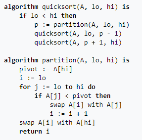
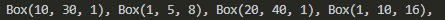

<center>
<h1>
In The Name Of ALLAH
</h1>
<h2>
Advanced Programming - Final Exam
</h2>
<h2>
Dr.Amir Jahanshahi
</h2>
<h3>
Saturday, 4 Bahman - 08:00

Deadline: 11:00
</center>


# Introduction
Today, you're gonna tell us how far you have gone in the world of advanced programmers.

# C++
We've been offered a good money on a project for an odd shop. This shop sells gold and mirror! We should sort its products by value in the ascending order. Each product has a box with specified *height*, *width* and *length*. A gold value is defined as 10 times its volume (**10 * heigth * width * length**) and a mirror value is defined as its ordinary volume (**heigth * width * length**).

We want to do the sort operation with the famous **Quick Sort** algorithm. Below, you can see how quick sort is done.

## Quick Sort
Quicksort is a divide and conquer algorithm. It first divides the input array into two smaller sub-arrays: the low elements and the high elements. It then recursively sorts the sub-arrays. The steps for in-place Quicksort are:

*    Pick an element, called a pivot, from the array.

*    Partitioning: reorder the array so that all elements with values less than the pivot come before the pivot, while all elements with values greater than the pivot come after it (equal values can go either way). After this partitioning, the pivot is in its final position. This is called the partition operation.

*    Recursively apply the above steps to the sub-array of elements with smaller values and separately to the sub-array of elements with greater values.

You can see a pseudocode for its implementation below.



So you must implement the **quickSort** function so that it gets a begin iterator and an end iterator to do the quick sort. Your function must work for any container with random access ability like vectors and deques.

**Note**: It is recommended to test your implementation with some arbitrary integers of your choice, just like the first 2 gtests.

## Classes
If you've reached here, congratulations. You've come most of the way. Now you must code the following classes with the following member functions and variables.

```c++
class Box{
    public:
        double height;
        double width;
        double length;
        double value();
        Box(double h, double w, double l);
};

class GoldBox: public Box{
    public:
        GoldBox (double h, double w, double l);
        double value();
};

class MirrorBox:public Box{
    public:
        MirrorBox (double h, double w, double l);
        double value();
};
```

**Note**: You must not add any other function or variable to the classes, but, you **can** and maybe **should!** add some keywords wherever necessary!

**Note**: Keep in mind that you must define ```operator<``` just once in all your codes! and the following block should run with no errors.

```c++
std::shared_ptr<Box> pg1{std::make_shared<GoldBox>(1, 5, 8)}, pm1{std::make_shared<MirrorBox>(20, 40, 1)};
std::shared_ptr<Box> pg2{std::make_shared<GoldBox>(1, 10, 16)}, pm2{std::make_shared<MirrorBox>(10, 30, 1)};
std::vector<std::shared_ptr<Box>> arr{pg1, pm1, pg2, pm2};
quickSort(arr.begin(), arr.end());
for (size_t i{}; i<arr.size(); i++)
    std::cout<<*arr[i]<<", ";
std::cout<<std::endl;
```

The result should be the following.



Finally note that there should be no way to create an object of the **Box** class. Any attempt to create a Box object should get an error!


# main File
You must not alter the **main.cpp** file at all. Good luck!


